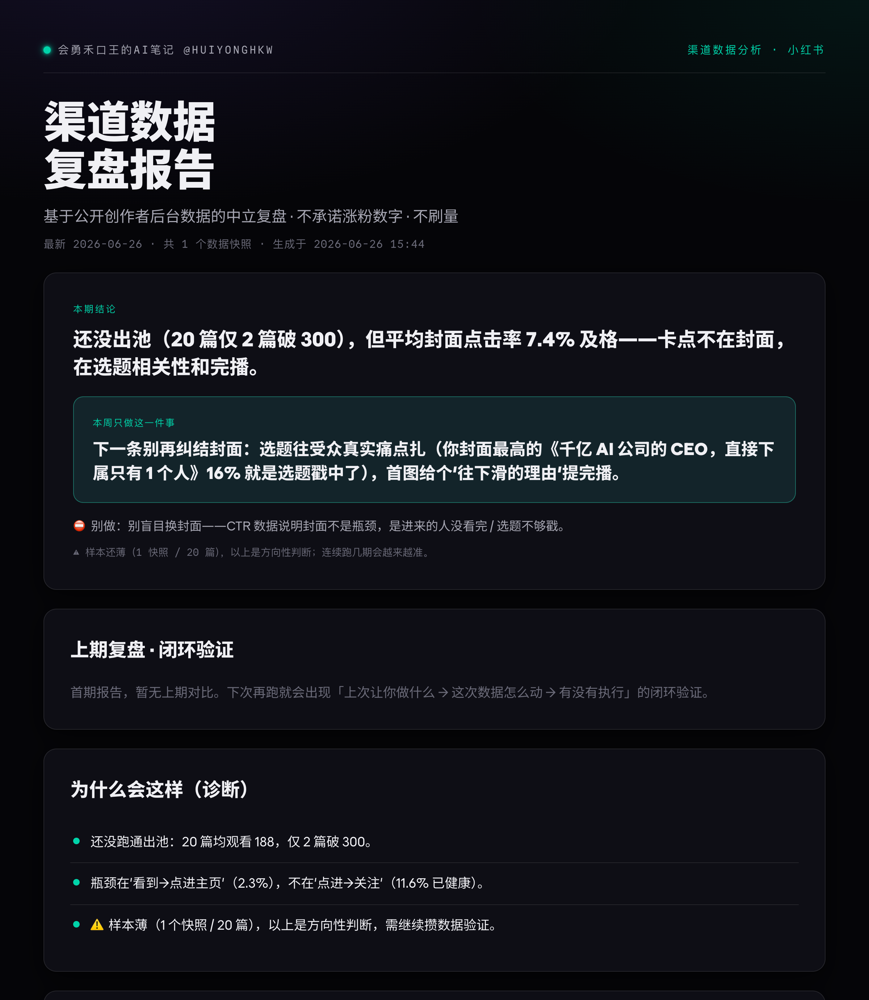

# hekouwang-channel-analyst-skill · 渠道数据分析师

> 会勇禾口王的AI笔记 · `@huiyonghkw`
> 把社媒账号的公开后台数据，做成一份能看、能交付、能指导动作的复盘报告。

一个 [Claude Agent Skill](https://docs.claude.com/en/docs/claude-code/skills)：
**每日取数 → 分析 → 生成 V1 暗黑「渠道数据复盘报告」HTML → 给分优先级的数据建议**。
v1 覆盖小红书；结构按多渠道/多账号预留。



> ☝️ 用本工具给作者自己账号（@huiyonghkw）生成的真实报告。**判断优先**：开头先给「账号状态 + 本周只做这一件事 + 别做什么」，再是上期复盘（闭环验证）、诊断、建议；图表（漏斗/趋势/红黑榜/限流体检）一律降级为「支撑数据」放后面。判断型报告默认是"安静"的——模块只在有话说时才冒头。

## 能做什么

- **取数**：用 [OpenCLI](https://github.com/jackwener/opencli) 复用 Chrome 登录态，拉小红书创作者后台的粉丝 / 转化漏斗 / 逐篇数据 / 每日明细，追加进 CSV 时间序列。
- **分析**：算固定指标体系——涨粉漏斗（观看→主页→涨粉）、出池诊断、笔记红黑榜、趋势、**涨粉目标测算**（到 N 粉还需多少出池笔记 + 转化率杠杆）、指标基准对照、逐篇判决。
- **报告**：输出自托管单文件 HTML（**V1 暗黑科技风**，绿/紫霓虹 + 思源黑体），ECharts 漏斗 / 趋势 / 红黑榜条形图，可截图 / 转 PDF / 转长图交付。判断在前、数据降为证据。
- **建议**：围绕「复制标杆」（动态识别观看最高那条）的实验化动作，每条挂账号真实数字；结论区只给「本周一件事」+ 显式「别做什么」（止损 / 聚焦）。
- **闭环验证**：`复盘历史.json` 存每期结论 + 指标，下期自动对比「上次让你做什么 → 数据怎么动 → 有没有执行」。

## 合规底线（写进 skill）

不刷量、不互关刷粉、不承诺涨粉数字；数据只来自账号自己的公开创作者后台。

## 三步流水线

```bash
# 前置：opencli + Chrome 登录态 + 扩展已连（opencli doctor 看 [OK] Extension）
python3 scripts/pull.py        --data-dir <数据目录>   # ① 取数 → CSV
python3 scripts/analyze.py     --data-dir <数据目录>   # ② 分析 → report_data.json
python3 scripts/build_report.py --data-dir <数据目录>  # ③ 报告 → 渠道数据复盘报告-V1暗黑.html
```

数据默认写到当前工作目录下的 `渠道数据分析师/`（可用 `--data-dir` 改；多账号给各自目录）。
每日自动取数用 macOS launchd 定时跑 `pull.py`（配方见 `references/01-取数.md`）。

## 结构

```
SKILL.md              # 触发词 + 方法论 + 合规底线 + 路由
references/
  01-取数.md          # opencli 命令 / CSV schema / launchd 自动化 / 加渠道·加账号
  02-分析框架.md      # 指标定义 / 阈值 / 诊断与建议规则（可调参）
  03-报告设计.md      # 报告 HTML 规范 / ECharts 防踩坑 / 自用版 vs 客户版
  04-服务化.md        # 付费服务化：套餐 / 定价参考 / 获客 / 交付
scripts/              # pull.py / analyze.py / build_report.py
assets/echarts.min.js # 报告图表库（Apache-2.0，内联进报告，单文件离线可截图）
```

## 安装

放进 Claude 的 skills 目录即可被自动发现：

```bash
git clone https://github.com/huiyonghkw/hekouwang-channel-analyst-skill.git \
  ~/.claude/skills/hekouwang-channel-analyst-skill
```

报告字体默认引用 `hekouwang-content-factory` 内置的 Anthropic 字体；没有时用 `build_report.py --font-dir` 指定，或换系统字体。

## 生态依赖（与哪些 skill / 工具协作）

性质＝**软依赖**：核心三件套（pull / analyze / build_report）能独立跑，下面是协作关系而非硬绑定。

| 依赖 | 类型 | 用在哪 | 缺了会怎样 |
|---|---|---|---|
| [OpenCLI](https://github.com/jackwener/opencli) / agent-reach | 工具（必需取数） | 复用 Chrome 登录态拉创作者后台 | 取不到数；但已有 CSV 仍可分析 + 出报告 |
| `hekouwang-content-factory` | 软依赖 | 报告字体（Anthropic + 思源黑体）/ 视觉；封面返工、小红书图也走它 | 字体回退——`build_report.py --font-dir` 换系统字体即可 |
| `hekouwang-claude-skill-doctor-skill` | 质量 | 本 skill 自身体检（现 100/100） | 不影响运行 |
| Apache ECharts | 内置 | 报告图表（已内联进 `assets/`） | 已随仓库分发，无需联网 |

## 免费内核 vs 增值付费

| | 免费（本开源仓库） | 增值（付费服务） |
|---|---|---|
| 是什么 | `pull/analyze/build_report` 三件套 + 自用版报告 | 人的解读 + 品牌报告 + 配套内容生产 |
| 谁用 | 任何人 `git clone` 本地跑 | 找 [@huiyonghkw](https://github.com/huiyonghkw) 下单的客户 |

**一句话口径**：**跑工具免费；"看得懂的解读 + 好看的品牌报告 + 照着改的内容生产"是付费。**

增值三层（叠加，靠组合其它 skill 交付）：

1. **解读层**：把数据翻成"下一步具体做什么"——单次诊断 / 周报 / 月度陪跑。工具给数据，人给判断。
2. **品牌报告层**：客户版报告（`build_report.py --mode client`，落款换服务方品牌 + CTA），用 content-factory 私有品牌字体/版式。
3. **内容生产层**：诊断指出"封面返工 / 选题换"后直接承接生产——图文走 `hekouwang-content-factory`、财经走 `hekouwang-stock-data-reader-skill`、演示走 `hekouwang-yandu-deck-skill`。

> 边界铁律：**开源仓库只放免费内核**（不含私有字体、不含任何客户数据）；增值部分靠"人 + 私有资产 + skill 组合"交付。完整服务化方案见 [`references/04-服务化.md`](references/04-服务化.md)。

## 第三方

- [Apache ECharts](https://echarts.apache.org/)（`assets/echarts.min.js`）— Apache License 2.0。

---

—— 会勇禾口王的AI笔记 · `@huiyonghkw`
不聊 AI 会不会取代你，只聊先用 AI 的人怎么取代你。
